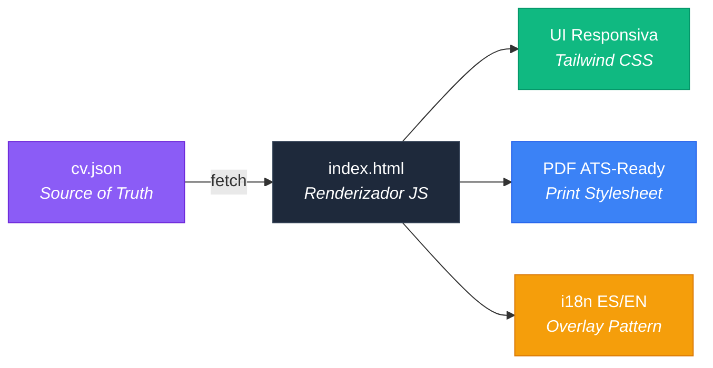
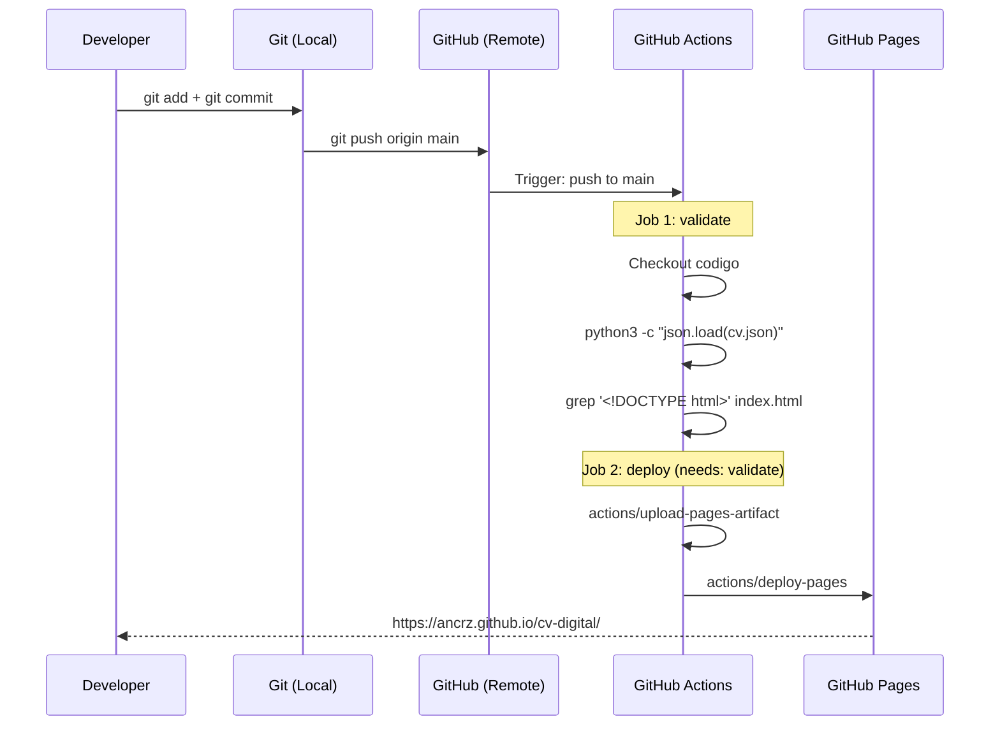

# CV Digital — Anthony Cruz

[](https://github.com/ancrz/cv-digital/actions/workflows/deploy.yml)
[](LICENSE)
[](#arquitectura)
[](#features)

> **Schema-Driven CV**: los datos viven en JSON, la presentacion en HTML. Editas un archivo, el pipeline despliega.

## Live

**[https://ancrz.github.io/cv-digital/](https://ancrz.github.io/cv-digital/)**

---

## Por que este proyecto existe

La mayoria de los CVs online son PDFs estaticos o templates de WordPress que mueren en el ATS (Applicant Tracking System) del reclutador. Este proyecto resuelve eso con una arquitectura donde:

- **Los datos son datos** (`cv.json`) — no estan mezclados con el HTML
- **La presentacion es presentacion** (`index.html`) — renderiza cualquier JSON valido
- **El deploy es automatico** — push a `main` y GitHub Actions se encarga

El resultado: un CV que se ve bien en el browser, se imprime optimizado para ATS, soporta dark mode, i18n (ES/EN), y se actualiza editando un solo archivo JSON.

---

## Arquitectura

```
cv-digital/
├── data/
│   └── cv.json          ← Source of truth (TODOS los datos del CV)
├── assets/
│   └── favicon.svg      ← Icono del sitio
├── index.html           ← SPA: renderiza cv.json en HTML responsivo
├── .github/
│   └── workflows/
│       └── deploy.yml   ← CI/CD: valida JSON + despliega a GitHub Pages
├── LICENSE              ← Hybrid Restrictive License
└── README.md            ← Este archivo
```

### El Flujo Schema-Driven



---

## Como funciona el Deploy (CI/CD)

### Git vs GitHub CLI — Cual es cual?

| Herramienta | Que es | Que hace |
|---|---|---|
| **Git** (git bash) | Sistema de control de versiones | Maneja commits, branches, push/pull — trabaja con tu codigo LOCAL y lo sincroniza con el REMOTE |
| **GitHub CLI** (`gh`) | Cliente oficial de GitHub | Interactua con la API de GitHub: crear PRs, issues, releases, configurar repos — cosas que harias en la WEB |

**Git** mueve codigo. **GitHub CLI** gestiona el repositorio.

### El Pipeline Completo



### GitHub Actions — Preguntas Frecuentes

**Que es GitHub Actions?**
Un servicio de CI/CD integrado en GitHub. Cuando haces push, ejecuta tareas automaticas definidas en archivos YAML (`.github/workflows/`).

**Que es un Runner?**
Una maquina virtual (VM) que ejecuta tus workflows. GitHub provee runners gratuitos con Ubuntu, Windows y macOS.

**Es gratis?**
Si, para repositorios publicos. Los repos publicos tienen **minutos ilimitados** de GitHub Actions. Repos privados tienen 2,000 min/mes en el plan Free.

**Que limites tiene?**

| Recurso | Limite (repo publico) |
|---|---|
| Minutos de ejecucion | Ilimitados |
| Jobs concurrentes | 20 |
| Tiempo max por job | 6 horas |
| Artefactos (artifacts) | 500 MB |
| GitHub Pages (tamaño) | 1 GB |

**Que hace el `deploy.yml` de este repo?**

```yaml
# Trigger: cada push a main
on:
  push:
    branches: [main]

# Job 1: Validar que cv.json sea JSON valido y que index.html exista
# Job 2: Subir archivos como artifact y deployar a GitHub Pages
```

### El Flujo de Branches

```mermaid
gitgraph
    commit id: "init"
    branch dev
    checkout dev
    commit id: "feat: CV v4.1.0"
    commit id: "ci: deploy workflow"
    checkout main
    merge dev id: "PR #1"
    commit id: "deploy → Pages"
```

**Estrategia:**
- `dev` — rama de desarrollo, aqui se trabaja
- `main` — rama de produccion, aqui se despliega
- Push a `main` → trigger automatico → validate → deploy

---

## Features

| Feature | Descripcion |
|---|---|
| **Schema-Driven** | `cv.json` es la unica fuente de verdad. Editar datos = editar JSON |
| **i18n ES/EN** | Toggle de idioma con overlay pattern (EN sobreescribe campos sobre ES base) |
| **Dark Mode** | Default dark, toggle persistido en localStorage |
| **ATS Print** | Stylesheet optimizado para recruiters: plain text, 2 columnas, sin decoracion |
| **Responsive** | Mobile-first: grid 2x2 footer, contacto centrado, cards adaptivas |
| **Share CTA** | Web Share API con fallback a clipboard |
| **Interactive** | Tool badges → Core Skills reactive linking con animacion |
| **GitHub Activity** | Heatmap seeded + repos destacados desde JSON |

---

## Como actualizar el CV

```bash
# 1. Editar datos
vim data/cv.json

# 2. Commit y push
git add data/cv.json
git commit -m "update: actualizar experiencia"
git push origin main

# 3. Esperar ~1 minuto
# GitHub Actions valida el JSON y despliega automaticamente
```

Para agregar traducciones EN, editar el bloque `i18n.en` dentro de `cv.json`.

---

## Stack

| Capa | Tecnologia |
|---|---|
| Markup | HTML5 semantico |
| Styling | Tailwind CSS v3 (CDN) |
| Logic | Vanilla JavaScript (ES6+) |
| Data | JSON (Schema-Driven) |
| CI/CD | GitHub Actions |
| Hosting | GitHub Pages |
| Icons | Font Awesome 6.7 |
| Fonts | Inter (Google Fonts) |

---

## Estructura del JSON

```jsonc
{
  "meta": {
    "version": "4.1.0",
    "schema": "Schema-Driven CV",
    "labels_ats": { /* labels para print/ATS */ }
  },
  "personal": { /* nombre, titulo, email, links */ },
  "perfil": "Texto del perfil en ES...",
  "perfil_ats": "Version optimizada para ATS...",
  "experiencia": [ /* array de cargos con logros */ ],
  "educacion": [ /* formacion academica */ ],
  "certificados": [ /* certs con emisor y fecha */ ],
  "core_skills": [ /* skills con nivel % e icono */ ],
  "tools_platforms": [ /* tools con related_core */ ],
  "candidate_alignment": { /* perfil tecnico para ATS */ },
  "github": { /* stats, repos destacados */ },
  "i18n": {
    "en": { /* traducciones EN (overlay sobre ES) */ }
  }
}
```

---

## License

Este proyecto esta bajo la [Hybrid Restrictive License](LICENSE).

- **Uso educativo/portfolio**: Permitido con atribucion
- **Uso comercial**: Prohibido sin autorizacion escrita
- **Fork para CV personal**: Permitido (no comercial, con atribucion)

Ver [LICENSE](LICENSE) para los terminos completos.

---

## Author

**Anthony Cruz** — DevOps Engineer

- [LinkedIn](https://www.linkedin.com/in/ancrz/)
- [GitHub](https://github.com/ancrz)
- [Docker Hub](https://hub.docker.com/repositories/ancrz)
- [CV Live](https://ancrz.github.io/cv-digital/)

---

<sub>Schema-Driven CV v4.1.0 · Built with Claude Code</sub>
