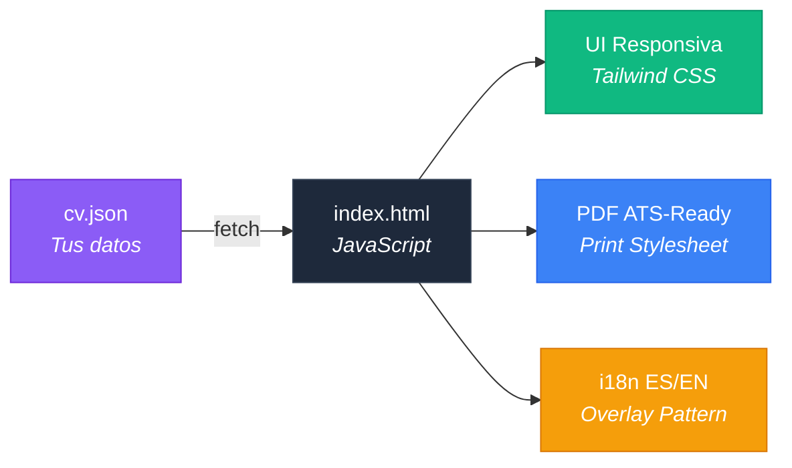
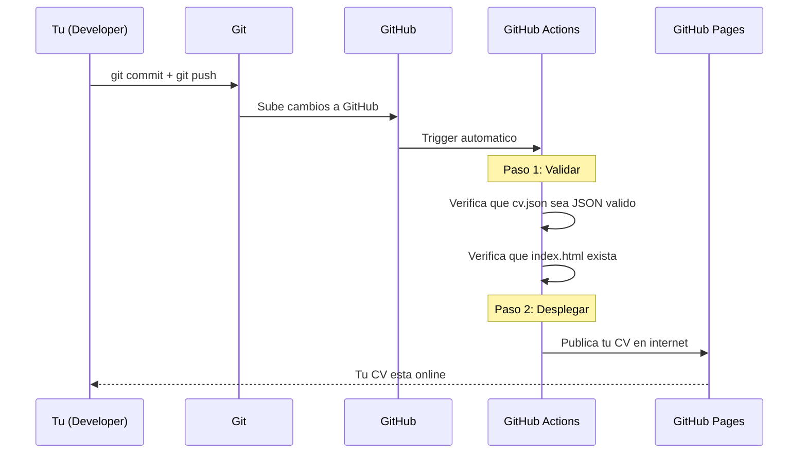

# CV Digital — Tu CV profesional, desplegado automatico

[](https://github.com/ancrz/cv-digital/actions/workflows/deploy.yml)
[](LICENSE)
[](#como-funciona-por-detras)
[](#features)

> **Editas un archivo JSON con tus datos, haces push, y tu CV se despliega solo en internet.** Sin servidor, sin hosting de pago, sin saber programar.

**Demo en vivo:** [https://ancrz.github.io/cv-digital/](https://ancrz.github.io/cv-digital/)

---

## Que vas a aprender

Al terminar esta guia vas a entender y haber usado:

| Concepto | Que es |
|---|---|
| **Git** | Sistema de control de versiones — guarda el historial de cada cambio en tu codigo |
| **GitHub** | Plataforma donde se aloja tu codigo y colaboras con otros |
| **Fork** | Copia de un proyecto a tu propia cuenta de GitHub |
| **CI/CD** | Integracion y Despliegue Continuos — automatizar pruebas y publicacion |
| **GitHub Actions** | El motor de CI/CD de GitHub — ejecuta tareas automaticas cuando haces cambios |
| **GitHub Pages** | Hosting gratuito de GitHub — tu sitio web online sin pagar nada |
| **Schema-Driven Development** | Metodologia donde los datos (JSON) estan separados de la presentacion (HTML) |

No necesitas experiencia previa. Esta guia te lleva paso a paso.

---

## Requisitos

1. **Una computadora con internet**
2. **Una cuenta de GitHub** — Si no tienes una, creala gratis en [github.com/signup](https://github.com/signup)
3. **Git instalado** (solo si quieres editar en tu computadora, no es obligatorio):
   - **Windows:** Descarga [Git for Windows](https://git-scm.com/download/win) e instala con las opciones por defecto
   - **Mac:** Abre Terminal y ejecuta `git --version` (se instala automaticamente si no lo tienes)
   - **Linux:** `sudo apt install git` (Ubuntu/Debian) o `sudo dnf install git` (Fedora)

---

## Paso a Paso — Tu CV en 15 Minutos

### Paso 1: Haz un Fork del proyecto

Un **fork** es una copia completa de este proyecto en tu propia cuenta de GitHub. Es tuyo, puedes modificarlo libremente.

1. Asegurate de haber iniciado sesion en GitHub
2. En la pagina de este repositorio, haz clic en el boton **"Fork"** (esquina superior derecha)
3. GitHub creara una copia en `https://github.com/TU-USUARIO/cv-digital`

> Listo. Ahora tienes tu propia version del proyecto.

### Paso 2: Activa GitHub Pages

GitHub Pages es un servicio gratuito que convierte tu repositorio en un sitio web publico.

1. En **tu fork** (`https://github.com/TU-USUARIO/cv-digital`), ve a **Settings** (engranaje)
2. En el menu lateral, haz clic en **Pages**
3. En **Source**, selecciona **GitHub Actions**
4. No necesitas hacer nada mas aqui

> Tu CV estara disponible en: `https://TU-USUARIO.github.io/cv-digital/` (reemplaza `TU-USUARIO` por tu nombre de usuario real de GitHub).

### Paso 3: Personaliza tus datos

El archivo `data/cv.json` contiene **todos** los datos de tu CV. Es lo unico que necesitas editar.

#### Opcion A: Editar directamente en GitHub (sin instalar nada)

1. En tu fork, navega a `data/cv.json`
2. Haz clic en el icono de **lapiz** (editar) en la esquina superior derecha del archivo
3. Modifica los datos con tu informacion personal
4. Al terminar, haz clic en **"Commit changes"** (boton verde abajo)
5. GitHub Actions se encargara de validar y desplegar automaticamente

#### Opcion B: Clonar a tu computadora (para editar con VS Code u otro editor)

```bash
# Clona tu fork (reemplaza TU-USUARIO)
git clone https://github.com/TU-USUARIO/cv-digital.git

# Entra al directorio
cd cv-digital

# Abre con tu editor favorito
code .   # VS Code
```

#### Que campos editar en cv.json

```jsonc
{
  "personal": {
    "nombre": "Tu Nombre Completo",        // ← Tu nombre
    "titulo": "Tu Cargo Profesional",       // ← Ej: "Frontend Developer"
    "ubicacion": "Tu Ciudad, Pais",
    "email": "tu@email.com",
    "telefono": "+XX XXX XXX XXXX",
    "foto_url": "URL de tu foto",           // ← Ver opciones de foto abajo
    "disponible": true,                     // ← true si buscas empleo
    "links": {
      "github": "https://github.com/TU-USUARIO",
      "linkedin": "https://www.linkedin.com/in/TU-PERFIL/"
    }
  },
  "perfil": "Tu resumen profesional en espanol...",
  "experiencia": [
    {
      "empresa": "Nombre Empresa",
      "cargo": "Tu Cargo",
      "ubicacion": "Ciudad, Pais",
      "periodo": "2020 – Presente",
      "logros": [
        "Logro 1 con metricas y resultados.",
        "Logro 2 con impacto medible."
      ]
    }
  ],
  "educacion": [...],
  "certificados": [...],
  "core_skills": [...],
  "tools_platforms": [...],
  "i18n": { "en": { ... } }               // ← Traducciones al ingles (opcional)
}
```

> Para ver la estructura completa, revisa la seccion [Estructura del JSON](#estructura-del-json) mas abajo.

#### Tu foto de perfil (`foto_url`)

Tienes varias opciones para la foto que aparece en tu CV:

| Opcion | Como obtener la URL |
|---|---|
| **GitHub avatar** (recomendado) | Usa `https://avatars.githubusercontent.com/TU-USUARIO` — se genera automaticamente desde tu foto de perfil de GitHub |
| **Gravatar** | Si usas [Gravatar](https://gravatar.com), ve a tu perfil, clic derecho en tu foto → "Copiar direccion de imagen" |
| **LinkedIn u otra** | Sube tu foto a cualquier servicio y usa la URL directa de la imagen |
| **Sin foto** | Deja `foto_url` vacio (`""`) — si tienes un `username` en la seccion `github` del JSON, se usara tu avatar de GitHub automaticamente |

> **Fallback automatico:** Si tu `foto_url` no carga (link roto, servicio caido), el CV usara automaticamente tu avatar de GitHub como respaldo — siempre que tengas configurado el campo `github.username` en el JSON.

### Paso 4: Personaliza el diseno (opcional)

Si quieres cambiar colores, fuentes o secciones, edita `index.html`. No necesitas saber HTML — puedes usar IA para ayudarte (ver siguiente seccion).

### Paso 5: Guarda y despliega

- **Si editaste en GitHub:** Ya esta. Al hacer "Commit changes" se disparo el deploy automatico.
- **Si clonaste a tu computadora:**

```bash
git add data/cv.json
git commit -m "actualizar mi CV"
git push origin main
```

GitHub Actions automaticamente:
1. Valida que tu JSON sea correcto
2. Verifica que `index.html` exista
3. Despliega tu CV en GitHub Pages

> El proceso toma ~1 minuto. Si falla, ve al tab **Actions** en tu repo para ver que salio mal.

### Paso 6: Verifica tu CV

Visita `https://TU-USUARIO.github.io/cv-digital/` y confirma que todo se ve bien.

Funcionalidades incluidas:
- Dark mode (boton superior derecho)
- Cambio de idioma ES/EN (boton superior derecho)
- Descargar como PDF (boton "Descargar CV")
- Compartir perfil (boton en el footer)

---

## Genera tu CV con IA

No existe (todavia) un generador automatico, pero puedes usar **inteligencia artificial** para convertir tu CV actual al formato JSON de este proyecto en segundos.

### Como hacerlo

1. Abre [Claude](https://claude.ai) (recomendado) o [Gemini](https://gemini.google.com)
2. Copia y pega el siguiente prompt:

```
Tengo este CV:

[PEGA AQUI EL TEXTO DE TU CV ACTUAL]

Necesito que lo conviertas al formato JSON de un proyecto Schema-Driven CV.
La estructura debe seguir este formato exacto:

{
  "meta": { "lang": "es", "version": "4.1.0" },
  "personal": { "nombre", "titulo", "ubicacion", "email", "telefono", "foto_url", "disponible", "links": { "github", "linkedin" } },
  "perfil": "resumen profesional",
  "experiencia": [{ "empresa", "cargo", "ubicacion", "periodo", "logros": ["logro 1", "logro 2"] }],
  "educacion": [{ "institucion", "ubicacion", "titulo", "periodo" }],
  "certificados": [{ "nombre", "emisor", "fecha" }],
  "core_skills": [{ "nombre", "nivel" (0-100), "icono": "fa-brands fa-...", "color": "text-blue-500" }],
  "tools_platforms": [{ "nombre", "icono": "fa-solid fa-...", "related_core": ["skill1"] }]
}

Genera el JSON completo con mis datos reales. Para los iconos usa Font Awesome 6.
Si tengo experiencia en ingles, agrega un bloque "i18n": { "en": { ... } } con las traducciones.
```

3. La IA te devolvera el JSON completo listo para pegar en `data/cv.json`
4. Revisa que los datos sean correctos y haz commit

> **Tip:** Tambien puedes pegar el `index.html` y pedirle a la IA que cambie colores, fuentes o agregue secciones. No necesitas saber HTML.

---

## Estructura del Proyecto

```
cv-digital/
├── data/
│   └── cv.json              ← TUS DATOS — lo unico que debes editar
├── index.html               ← PAGINA WEB — editar si quieres cambiar el diseno
├── assets/
│   └── favicon.svg          ← Icono que aparece en la pestana del navegador
├── .github/
│   └── workflows/
│       └── deploy.yml       ← AUTOMATIZACION — no tocar, funciona solo
├── LICENSE                  ← Licencia del proyecto
└── README.md                ← Este archivo
```

---

## Features

| Feature | Descripcion |
|---|---|
| **Schema-Driven** | `cv.json` es la unica fuente de verdad. Editar datos = editar JSON |
| **i18n ES/EN** | Toggle de idioma con overlay pattern (EN se superpone sobre ES base) |
| **Dark Mode** | Default dark, toggle con persistencia en navegador |
| **ATS Print** | PDF optimizado para sistemas de reclutamiento: texto plano, sin decoracion |
| **Responsive** | Se adapta a celular, tablet y desktop |
| **Share** | Boton para compartir tu CV via WhatsApp, Telegram, email, etc. |

---

## Como funciona por detras

> Esta seccion es para curiosos. No necesitas entenderla para usar el proyecto.

### El flujo Schema-Driven

Tu JSON es la **unica fuente de verdad**. JavaScript lo lee y genera todo lo demas:



### El pipeline de CI/CD

Cada vez que haces push a `main`, GitHub Actions ejecuta automaticamente:



### Que es GitHub Actions?

Un servicio gratuito de GitHub que ejecuta tareas automaticas cuando haces cambios en tu codigo. En este proyecto, cada push a `main` dispara:

1. **Validacion:** Revisa que tu JSON no tenga errores de formato
2. **Deploy:** Sube tus archivos a GitHub Pages

Es gratis para repositorios publicos, con minutos ilimitados de ejecucion.

---

## Estructura del JSON

```jsonc
{
  "meta": {
    "lang": "es",                          // Idioma base
    "version": "4.1.0",                    // Version del schema
    "labels_ats": { ... }                  // Etiquetas para el PDF impreso
  },
  "personal": {
    "nombre": "...",                        // OBLIGATORIO
    "titulo": "...",                        // OBLIGATORIO — tu cargo profesional
    "ubicacion": "...",
    "email": "...",                         // OBLIGATORIO
    "telefono": "...",
    "foto_url": "...",                      // URL de tu foto
    "disponible": true,                    // true/false — muestra badge "Disponible"
    "links": {                             // Links a tus perfiles
      "github": "...",
      "linkedin": "..."
    }
  },
  "perfil": "...",                         // OBLIGATORIO — resumen profesional (2-3 oraciones)
  "perfil_ats": "...",                     // Version extendida para PDF/ATS
  "experiencia": [                         // OBLIGATORIO — array de empleos
    {
      "empresa": "...",
      "cargo": "...",
      "ubicacion": "...",
      "periodo": "2022 – Presente",
      "logros": ["Logro 1", "Logro 2"]    // Usa metricas: numeros, porcentajes
    }
  ],
  "educacion": [                           // Array de formacion academica
    {
      "institucion": "...",
      "ubicacion": "...",
      "titulo": "...",
      "periodo": "2009 – 2014"
    }
  ],
  "certificados": [                        // Array de certificaciones
    { "nombre": "...", "emisor": "Google", "fecha": "Jul 2025" }
  ],
  "core_skills": [                         // Skills principales con nivel 0-100
    { "nombre": "Docker", "nivel": 95, "icono": "fa-brands fa-docker", "color": "text-blue-500" }
  ],
  "tools_platforms": [                     // Herramientas secundarias
    { "nombre": "GCP", "icono": "fa-brands fa-google", "related_core": ["Docker", "Kubernetes"] }
  ],
  "github": {                             // Seccion GitHub (opcional)
    "username": "...",
    "stats": { "repos": 4, "stars": 3 },
    "repos_destacados": [{ "nombre": "...", "descripcion": "...", "lenguaje": "...", "url": "..." }]
  },
  "i18n": {                               // Traducciones al ingles (opcional)
    "en": {
      "perfil": "English version...",
      "experiencia": [{ "cargo": "...", "logros": ["..."] }],
      "educacion": [{ "titulo": "..." }]
    }
  }
}
```

> **Tip:** Los iconos usan [Font Awesome 6](https://fontawesome.com/icons). Busca el icono que necesites y usa su clase CSS.

---

## Preguntas Frecuentes

**Es gratis?**
Si. GitHub Pages es gratuito para repositorios publicos. No hay costos ocultos.

**Puedo usarlo en otro idioma?**
Si. El JSON base esta en espanol, pero puedes cambiar todo el texto a cualquier idioma. Si quieres soporte bilingue, agrega traducciones en el bloque `i18n`.

**Puedo cambiar los colores y el diseno?**
Si. Edita `index.html`. Puedes pegar el archivo en Claude o Gemini y pedirle los cambios que necesites.

**Que pasa si rompo algo?**
Git guarda el historial completo de cambios. Puedes revertir a cualquier version anterior desde GitHub.

**Necesito saber programar?**
No. Con una IA (Claude, Gemini) puedes editar tanto el JSON como el HTML sin conocimientos de programacion.

**Mi CV se ve diferente al demo?**
Porque los datos son diferentes. La pagina web renderiza lo que encuentre en tu `cv.json`. Si un campo esta vacio o falta, esa seccion no aparece.

---

## Stack Tecnico

| Capa | Tecnologia |
|---|---|
| Markup | HTML5 semantico |
| Styling | Tailwind CSS v3 (CDN) |
| Logica | Vanilla JavaScript (ES6+) |
| Datos | JSON (Schema-Driven) |
| CI/CD | GitHub Actions |
| Hosting | GitHub Pages |
| Iconos | Font Awesome 6.7 |
| Fuentes | Inter (Google Fonts) |

---

## Licencia

Este proyecto esta bajo la [Hybrid Restrictive License](LICENSE).

- **Uso educativo / portfolio:** Permitido con atribucion
- **Fork para CV personal:** Permitido (no comercial, con atribucion)
- **Uso comercial:** Prohibido sin autorizacion escrita

Ver [LICENSE](LICENSE) para los terminos completos.

---

## Autor

**Anthony Cruz** — DevOps Developer

- [LinkedIn](https://www.linkedin.com/in/ancrz/)
- [GitHub](https://github.com/ancrz)
- [Docker Hub](https://hub.docker.com/repositories/ancrz)
- [CV Live](https://ancrz.github.io/cv-digital/)

---

<sub>Schema-Driven CV v4.1.0</sub>
